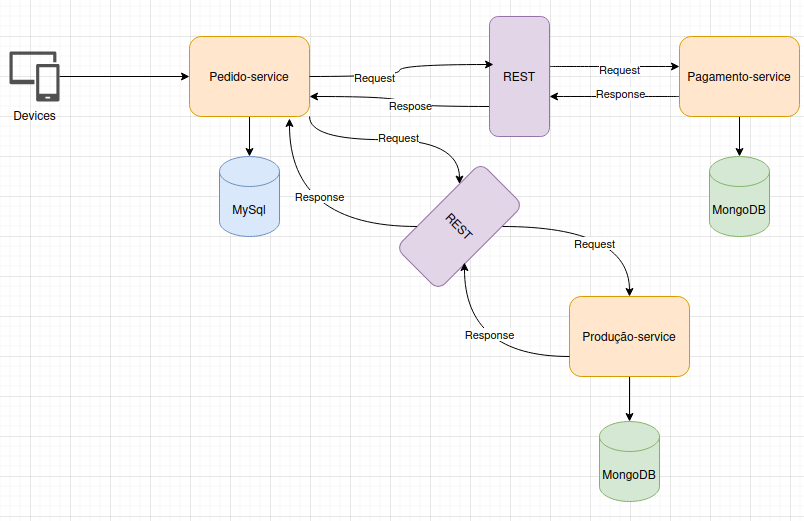
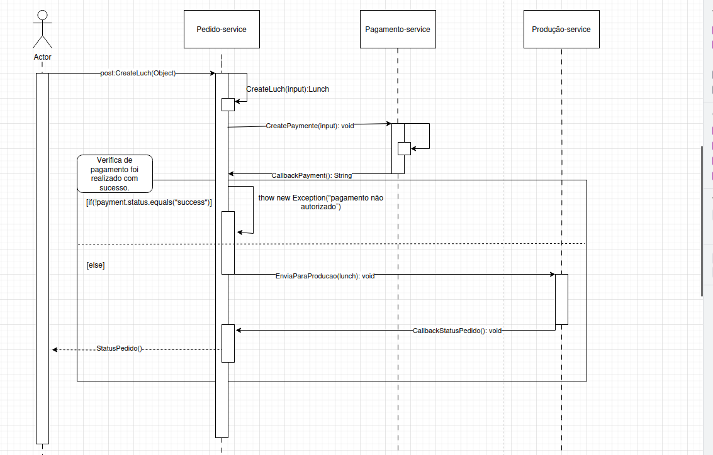

# Tech-Challenge Fiap - Software Architecture

## Introdução

O projeto foi desenvolvido no âmbito da pós graduação em *Software Architecture* da Fiap. Dado um contexto e um problema (descritos abaixo), foi desenvolvida uma aplicação *back-end* * em Java Spring Boot, utilizando os conteúdos aprendidos no curso.

### Contexto
Há uma lanchonete de bairro que está expandindo devido seu grande sucesso. Porém, com a expansão e sem um sistema de controle de pedidos, o atendimento aos clientes pode ser caótico e confuso. Por exemplo, imagine que um cliente faça um pedido complexo, como um hambúrguer personalizado com ingredientes específicos, acompanhado de batatas fritas e uma bebida. O atendente pode anotar o pedido em um papel e entregá-lo à cozinha, mas não há garantia de que o pedido será preparado corretamente.

Sem um sistema de controle de pedidos, pode haver confusão entre os atendentes e a cozinha, resultando em atrasos na preparação e entrega dos pedidos. Os pedidos podem ser perdidos, mal interpretados ou esquecidos, levando à insatisfação dos clientes e a perda de negócios.

Em resumo, um sistema de controle de pedidos é essencial para garantir que a lanchonete possa atender os clientes de maneira eficiente, gerenciando seus pedidos e estoques de forma adequada. Sem ele, expandir a lanchonete pode acabar não dando certo, resultando em clientes insatisfeitos e impactando os negócios de forma negativa.

### Problema
Para solucionar o problema, a lanchonete irá investir em um sistema de autoatendimento de fast food, que é composto por uma série de dispositivos e interfaces que permitem aos clientes selecionar e fazer pedidos sem precisar interagir com um atendente, com as seguintes funcionalidades:

- **Pedido**
- **Pagamento**
- **Acompanhamento**
- **Entrega**
- **Gerenciar clientes**
- **Gerenciar produtos e categorias**

#### Fase 1

Para acessas as informações da fase 1, [clique aqui](docs/README.fase1.md).

---------

#### Fase 2

Para acessas as informações da fase 2, [clique aqui](docs/README.fase2.md).
 
---------

#### Fase 3

Para acessas as informações da fase 3, [clique aqui](docs/README.fase3.md).
 
---------
#### Fase 4

O Projeto foi quebrado em 3 microserviços, são eles:
- **Pedido-Service**: Responsável por gerenciar os pedidos.
- **Pagamento-Service**: Responsável por gerenciar os meios de pagamento com integração mercadopago.
- **produção-Service**: Responsável por gerenciar os status dos pedidos.

## Arquitetura

## Tecnologias Utilizadas

- **Spring Boot**
- **Docker**
- **Docker Compose**
- **Mysql**
- **Adminer**
- **Swagger**

## Diagrama de sequência

## Postman

Arquivos disponíveis para importação:

[postman](./docs/app-fiap.postman_collection.json)

## Swagger
É possível realizar requisições via Swagger, [clicando aqui](http://localhost:30001/swagger-ui/index.html).

## Adminer
É possível acessar o banco de dados via Adminer [clicando aqui](http://localhost:30000/).

## Vídeo
É possível o vídeo com explicações sobre a arquitetura e infraestrutura [clicando aqui](https://youtu.be/Cl7rLaevhH4).

## Contatos
- [Felipe Pereira](https://github.com/FelipecgPereira)
- [Jequelia Santana Gomes](https://github.com/jequelia)
- [Marcelo C Batista](https://github.com/cxmarcelo)
- [Rafael Bernardo Roseno](https://github.com/RafaelRoseno)
- [Sara Akemi Watanabe](https://github.com/SaraAWatanabe)

