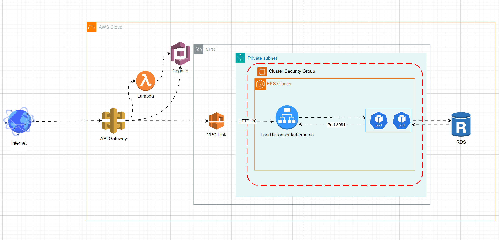
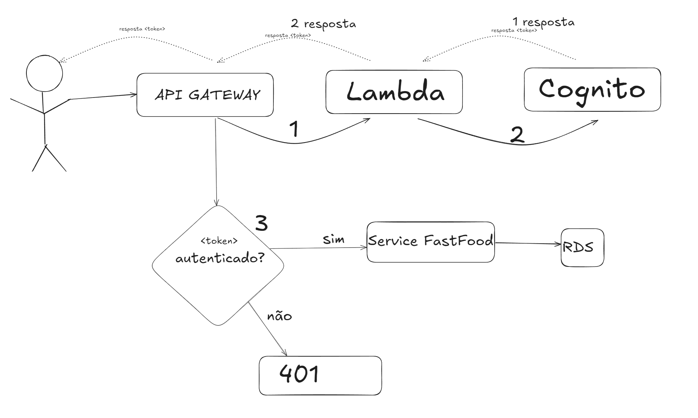
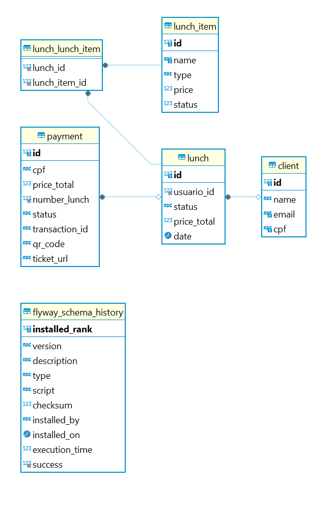

### Objetivos
# Fase 3

- Implementar um API Gateway e um function serverless para autenticação.
- Implementar um CI/CD para a aplicação.
    -   1 repositório para o Lambda.
    -  1 repositório para sua infra Kubernetes com Terraform.
    -   1 repositório para sua infra banco de dados gerenciáveis
        com Terraform.
    -   1 repositório para sua aplicação que é executada no
        Kubernetes.
- deploy automatizado na conta da
  nuvem utilizando actions.
- branchs main/master protegidas, não permitindo commits direto.
-  Melhorar a estrutura do banco de dados escolhido.

### Arquitetura da solução

###  Amazon RDS
Este projeto utiliza o Amazon RDS como solução de banco de dados relacional para gerenciar clientes,
refeições, pagamentos e o histórico de migração de schemas. Abaixo, detalhamos a estrutura do banco
de dados, os relacionamentos entre as tabelas e as principais considerações de modelagem.

O banco de dados modelado foi projetado para ser escalável, suportando operações complexas
com refeições e pagamentos. O uso do Amazon RDS como solução gerenciada permite alta disponibilidade e segurança,
além de facilidade na manutenção e migração de schemas utilizando o Flyway.

